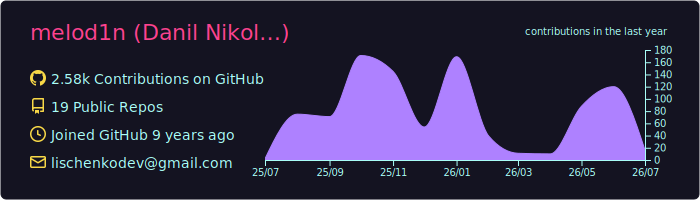
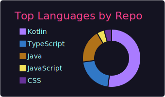
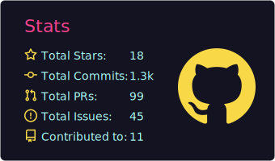

# Hi, I'm Danil 👋

Android & Kotlin Multiplatform developer building apps, bots and infrastructure around networking and local AI.

- Mainly working with Kotlin / Jetpack Compose / Compose Multiplatform
- Also build Telegram / VK bots and local LLM tools (Ollama/Gemini/Mistral/OpenAI)
- Enjoy self-hosting: Gitea, Jenkins, Docker

---

## What I'm working on

- **[fast-messenger](https://github.com/melod1n/fast-messenger)**  
  Unofficial VK messenger with modern Android stack (Compose, coroutines, modular architecture).

- **[tg-chat-bot](https://github.com/melod1n/tg-chat-bot)**  
  TypeScript + Node.js/Bun Telegram Bot with a lot of commands, DB, AI (Ollama/Gemini/Mistral/OpenAI), Docker and CI/CD.

---

## DevOps / Homelab

Outside of GitHub I maintain a small self-hosted setup:

- [Gitea](https://gitea.mlgt.ru) with Gitea Actions for Git hosting and CI/CD pipelines  
- Multiple services running in Docker on local servers (bots, backends, tools, media apps)

---

## GitHub stats

---

## Contact

<!--

-->
